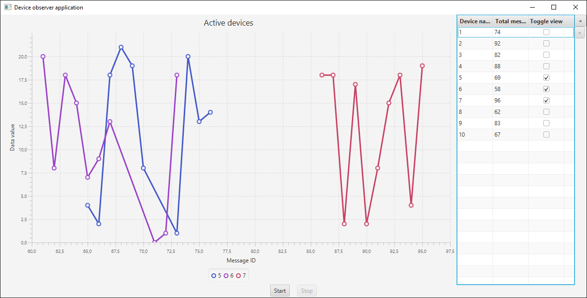

# Device observer application

## Installation and start

- run "install.cmd" for application installation - downloads all necessary dependencies (currently only JavaFX)
- run "run.cmd" for application start

"install.cmd" will compile the project and generates jar files in target/modules directory

## Requirement
- you monitor devices, which are sending data to you,
- each device has a unique name,
- each device produces measurements.

**Challenge**: compute number of messages you got or read from the devices.

## Solution
The created application simulates producing data from random devices 
and visualising this data in graph. Each line in the graph represents one device and its data.
In the table you can see information about current devices, its IDs and most importantly
count of all received messages for each device. Buttons right next to the table are used for
adding or removing new/existing devices.

To start simulation just hit the **start** button.

## Explanation
By default, there will be 10 initialized devices ready to produce data. There is one ExecutorService
initialized to contain 4 fixed worker threads. When simulation starts, four instances of device data
producer is created and attached to the executor service to generate data. Devices are picked randomly
and so are data produced by device. The Graph is updated periodically in UI thread. It checks
new data received from devices and add new values to the graph. If there is too many values, old will
be removed.

Total count of received messages is updated when new data are synchronized with GUI.
